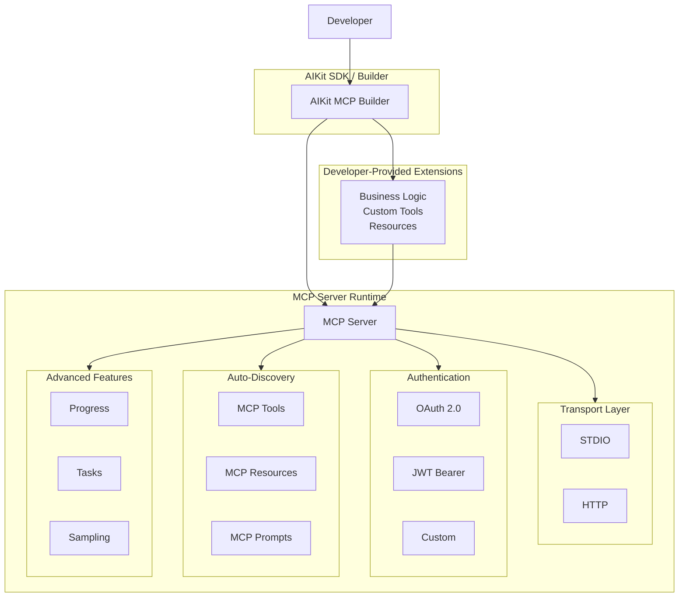

# AIKit.Mcp

**You focus on building business logic. AIKit handles the rest.**

A .NET wrapper library for the Model Context Protocol (MCP) SDK that simplifies MCP server configuration with fluent builder patterns. Designed to reduce complexity when building MCP servers in .NET Core, providing an intuitive API on top of the official MCP SDK.

## Features

- **Fluent Builder API**: Easy-to-use configuration with `AIKitMcpBuilder`
- **Transport Support**: Stdio and HTTP transports out of the box
- **Authentication**: OAuth 2.0, JWT Bearer, and custom authentication for HTTP transport
- **Auto-Discovery**: Automatically discovers tools, resources, and prompts from assemblies
- **Advanced MCP Features**: Tasks, progress notifications, completion, sampling, and elicitation
- **Logging**: Configurable logging with stderr redirection for clean stdio

## Architecture

AIKit.Mcp provides a clean abstraction over the MCP SDK, allowing you to focus on business logic while the framework handles protocol complexities.



## Installation

Install via NuGet:

```bash
dotnet add package AIKit.Mcp
```

## Quick Start

### Basic Stdio Server

```csharp
using AIKit.Mcp;
using Microsoft.Extensions.DependencyInjection;

var builder = Host.CreateApplicationBuilder(args);

builder.Services.AddAIKitMcp(mcp =>
{
    mcp.ServerName = "MyMcpServer";
    mcp.WithStdioTransport();
    mcp.WithAutoDiscovery();
});

var app = builder.Build();
await app.RunAsync();
```

### HTTP Server with Authentication

```csharp
using AIKit.Mcp;
using Microsoft.AspNetCore.Builder;

var builder = WebApplication.CreateBuilder(args);

builder.Services.AddAIKitMcp(mcp =>
{
    mcp.ServerName = "MyMcpServer";
    mcp.WithHttpTransport(opts =>
    {
        opts.HttpBasePath = "/mcp";
        opts.Authentication = new OAuthAuth
        {
            OAuthClientId = "your-client-id",
            OAuthScopes = new() { "mcp:tools" }
        };
    });
    mcp.WithAutoDiscovery();
});

var app = builder.Build();
await app.RunAsync();
```

## Tool Implementation

Create tools by decorating classes and methods:

```csharp
using ModelContextProtocol.Server;

[McpServerToolType]
public class MathTools
{
    [McpServerTool(Name = "add")]
    public double Add(double a, double b) => a + b;

    [McpServerTool(Name = "multiply")]
    public double Multiply(double a, double b) => a * b;
}
```

## Configuration Options

### Transport

- `WithStdioTransport()`: For command-line MCP clients
- `WithHttpTransport(Action<HttpTransportOptions>)`: For HTTP-based MCP communication

### Authentication (HTTP only)

- `OAuthAuth`: OAuth 2.0 with client credentials
- `JwtAuth`: JWT Bearer token validation
- `CustomAuth`: Custom authentication logic

### Discovery

- `AutoDiscoverResources`: Scan for `[McpServerResource]` classes
- `AutoDiscoverPrompts`: Scan for `[McpServerPrompt]` classes

### Features

- `EnableCompletion`: Auto-completion
- `EnableDevelopmentFeatures`: Debug logging

### Task Management

AIKit.Mcp supports both in-memory and file-based task stores for long-running operations:

- **In-Memory Store** (default): Tasks exist only during server runtime
- **File-Based Store**: Persistent task storage with configurable TTL and session isolation

```csharp
builder.Services.AddAIKitMcp(mcp =>
{
    // Enable file-based task store with custom options
    mcp.WithFileBasedTaskStore(opts =>
    {
        opts.StoragePath = Path.Combine(AppContext.BaseDirectory, "tasks");
        opts.DefaultTtl = TimeSpan.FromHours(24);
        opts.EnableSessionIsolation = true;
        opts.FileExtension = ".task";
    });
});
```

Task store options:

- `StoragePath`: Directory for task files (default: `./tasks`)
- `DefaultTtl`: Default time-to-live for tasks (default: 1 hour)
- `EnableSessionIsolation`: Isolate tasks by session ID (default: true)
- `FileExtension`: File extension for task files (default: `.json`)

## Advanced Usage

### Task Management

Use the task helpers for background operations and polling:

```csharp
using AIKit.Mcp;

public class TaskTools
{
    private readonly IMcpTaskStore _taskStore;

    public TaskTools(IMcpTaskStore taskStore)
    {
        _taskStore = taskStore;
    }

    [McpServerTool(Name = "submit_job")]
    public async Task<string> SubmitJob(string jobType)
    {
        // Create a background task
        var task = await McpTaskHelpers.CreateTaskAsync(
            _taskStore,
            new McpTaskMetadata { TimeToLive = TimeSpan.FromHours(1) },
            new RequestId(Guid.NewGuid().ToString()),
            new JsonRpcRequest { Method = "background_job" },
            "session-id",
            async (progressToken, cancellationToken) =>
            {
                // Simulate long-running work
                for (int i = 0; i < 10; i++)
                {
                    await Task.Delay(1000, cancellationToken);
                    await McpTaskHelpers.ReportProgressAsync(
                        _taskStore, progressToken, i * 10, 100, $"Processing step {i}");
                }
                return JsonSerializer.SerializeToElement(new { result = "Job completed" });
            });

        return $"Job submitted with task ID: {task.TaskId}";
    }

    [McpServerTool(Name = "poll_task")]
    public async Task<string> PollTask(string taskId)
    {
        var task = await _taskStore.GetTaskAsync(taskId, "session-id");
        if (task == null) return "Task not found";

        return task.Status switch
        {
            McpTaskStatus.Working => $"Task is running (progress: {task.Progress?.Percentage ?? 0}%)",
            McpTaskStatus.Completed => $"Task completed: {await _taskStore.GetTaskResultAsync(taskId, "session-id")}",
            McpTaskStatus.Cancelled => "Task was cancelled",
            _ => "Task status unknown"
        };
    }
}
```

### Progress Reporting

```csharp
using AIKit.Mcp;

public class LongRunningTool
{
    [McpServerTool(Name = "long_task")]
    public async Task<string> LongTask(McpServer server, ProgressToken token)
    {
        for (int i = 0; i < 100; i++)
        {
            await McpTaskHelpers.ReportProgressAsync(server, token, i, 100, $"Step {i}");
            await Task.Delay(100);
        }
        return "Completed";
    }
}
```

### Message Filters

```csharp
builder.Services.AddAIKitMcp(mcp =>
{
    mcp.MessageFilter = () => next => async (context, ct) =>
    {
        Console.WriteLine($"Incoming: {context.JsonRpcMessage.Method}");
        await next(context, ct);
        Console.WriteLine("Message processed");
    };
});
```

## Building and Testing

```bash
# Build all projects
dotnet build src/AIKit.Mcp.slnx

# Run tests
dotnet test src/AIKit.Mcp.Tests/AIKit.Mcp.Tests.csproj
```

## Dependencies

- ModelContextProtocol (>= 0.8.0-preview.1)
- Microsoft.Extensions.Logging (>= 10.0.2)
- Microsoft.AspNetCore.Authentication.JwtBearer (>= 10.0.2) [for HTTP auth]

## Contributing

Contributions welcome! Please see issues for current tasks.

## License

MIT License - see LICENSE file for details.

## Roadmap

- [ ] NuGet package release
- [ ] Additional authentication providers
- [ ] WebSocket transport support
- [ ] Performance optimizations
